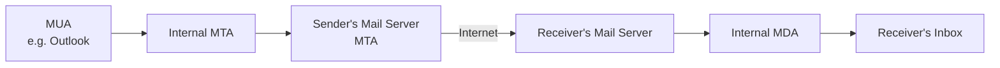

# Proofpoint — Outbound/Inbound Email Communication Process

Understanding the path a message takes from sender to receiver is what makes the rest of Proofpoint's configuration (URL Defense, Attachment Defense, imposter protection) make sense — each control sits at a specific point along this path.

## The lifecycle of an email

1. The lifecycle starts at the **MUA (Mail User Agent)** — the client the sender uses to compose and send the message, such as Outlook.
2. The message goes to the **internal MTA (Message Transfer Agent)** — the mail transfer agent inside the sender's own network.
3. The internal MTA transfers the message to the organization's **mail server**, which is also an MTA.
4. The sending mail server transmits the message across the internet to the **receiving organization's mail server**.
5. The receiving mail server passes the message to the **internal MDA (Mail Delivery Agent)**.
6. The receiver retrieves the message from their mailbox.

!!! note
    The source notes describe this lifecycle to explain the general path a message takes, without specifying at which exact hop Proofpoint's own gateway sits. As a cloud email security gateway, Proofpoint's filtering (URL Defense, Attachment Defense, imposter detection) is applied to mail as it transits the MTA stage — before the message reaches the receiver's inbox.
