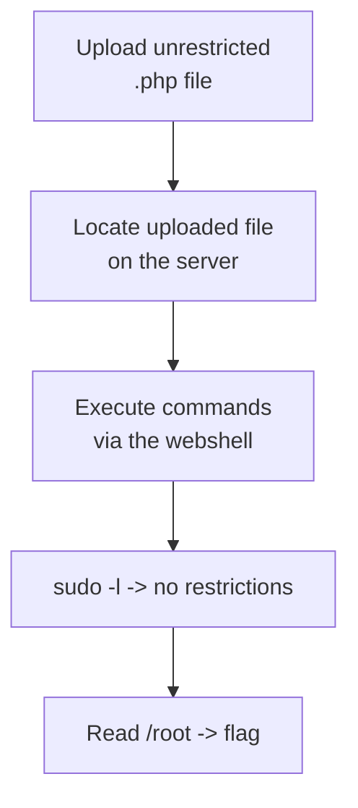
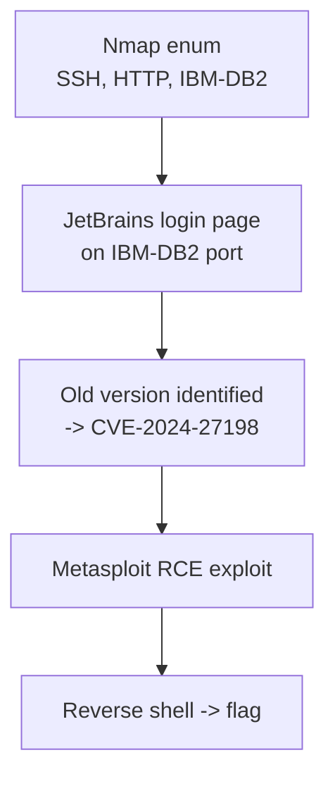
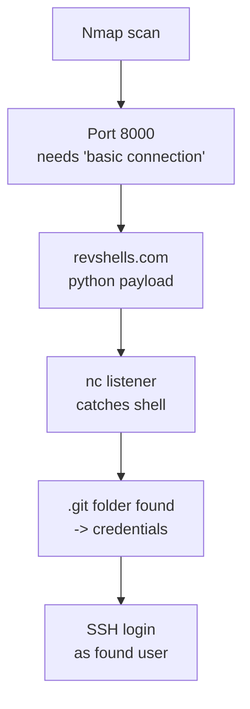

# Web Hacking — File Upload

!!! warning "Authorized testing only"
    These are personal notes from authorized labs, CTFs (picoCTF/THM), and bug-bounty programs (Udemy). Only test file-upload functionality on systems you own or have explicit written permission to test.

File upload vulnerabilities happen when an application lets a user upload a file but doesn't properly restrict *what kind* of file gets accepted or *where/how* it can later be accessed — if an attacker can get server-side code (like a PHP script) onto the server and then get the server to execute it, that's remote code execution (RCE). This page covers both real practical examples of exploiting upload-triggered shells, and a hands-on progression through increasingly strict upload-validation code, showing exactly which checks a secure implementation needs and how each weaker version gets bypassed.

For the underlying shell theory (staged vs non-staged, reverse vs bind shell, payload generation), see [Shells](shells.md).

## Reverse shell via file upload — practical examples

### picoCTF file upload RCE

- Severity: critical (10/10).
- Target: [picoCTF — challenge 482](https://play.picoctf.org/practice/challenge/482?category=1&page=1)
- What this is: exploiting the file-upload mechanism on the site to upload malicious code, then execute it.

**Chain overview:**



**Security implication:**

1. Full access of the machine was taken.
2. Data leak — the machine is within the attacker's hands.

**Analysis:**

- **Why test the upload mechanism first:** before anything else, check whether the upload field is sanitized at all — can *any* file type be inserted? This was tested by uploading a PHP file.
- It appeared that the mechanism accepted anything, so a malicious PHP webshell was uploaded (a minimal command-execution snippet that runs whatever is passed in the `cmd` request parameter through the system shell).
- **Why locate the uploads folder next:** the webshell is useless until we know the URL path it landed at — once uploaded, the next step was figuring out where the `uploads/` folder actually is.
- The uploaded file was found at `uploads/cmd.php`.
- **Why check `sudo -l` next:** now that command execution is possible via the webshell, the natural next question is *what can this user run as another user/root* — `sudo -l` is the fastest way to answer that.

```bash
sudo -l
```

- The machine had no restrictions on `sudo` — this is a major win, so the root directory was accessed directly:

```bash
sudo ls /root
```

- The flag was found in the root directory and read with `cat`.

**Recommendations:**

1. Add sanitization to the upload mechanism (validate file type/extension server-side, not just by name).
2. Restrict `sudo` privileges for all users on the system — this machine already had root-level `sudo` access for the compromised account, which is what turned a webshell into full root.

### Reverse shell via JetBrains CVE-2024-27198

- Task: reach the user's home folder and find `flag.txt`, achievable only via a reverse shell — required enumeration and scanning first to figure out the path in.

**Chain overview:**



- **Enumeration phase** — Nmap scan of the target found 3 open ports: SSH, HTTP, and IBM-DB2.

```bash
nmap <target>
```

- HTTP showed a page "under maintenance" with nothing useful in the browser inspector; `gobuster` was run against it while pivoting to the other ports.
- The IBM-DB2 port turned out to host a login page related to **JetBrains** — the version shown was old, which is the first thing worth checking for a matching exploit.
- Searching turned up an exact-version exploit: **CVE-2024-27198**, which allows RCE against the victim's machine.
- The exploit was run via Metasploit (options set, then executed) and returned a reverse shell.
- Flag: `THM{faa9bac345709b6620a6200b484c7594}`

### Reverse shell practical example (blind reverse shell via revshells.com)

**Chain overview:**



- Initial network scan with `nmap` found a service on port 8000 that responded with a hint about needing "a more basic connection" — not immediately clear what that meant, so external research (Google, then AI assistance) was used.
- A blind reverse shell was attempted using Python, generated via [revshells.com](https://www.revshells.com/) — the first payload option didn't work, but a second one did.
- **Why set up the listener first:** a reverse shell payload is useless without something on the attacker side ready to catch the incoming connection — the listener has to be running *before* the payload executes.

```text
nc -lvnp 4444
```

- After triggering the payload, the shell connected back to the listener.
- **Why search the filesystem next:** once inside, the goal shifts to finding anything of value — credentials, passwords, or the flag.
- A `.git` folder was found inside a `dev` directory, and searching through it revealed credentials for a user (found in the git history).
- **Why try those credentials over SSH:** SSH was one of the open ports identified during recon, and reusing freshly-found credentials against every other open login service is standard practice.
- The same credentials worked over SSH, giving full access and the user flag.

## File upload project — validation bypass walkthrough

This is a standalone, self-built file-upload testbed (not an HTB/THM machine) used to understand file-upload security from the defender's side: start from a completely open upload endpoint, add one security control at a time, and try to bypass each one. See [Labs → File Upload Project (Udemy bug bounty)](labs.md#file-upload-project-bug-bounty-case-study) for the real-world bug-bounty case study that used the same bypass techniques against a live target.

### First attempt to upload an RCE

- The first payload tried was a simple PHP command-execution webshell (a script that runs whatever is passed in the `cmd` parameter through `system()`).
- It worked immediately — the upload endpoint had **no validation at all**. The vulnerable upload handler simply took the uploaded file and moved it straight into a public `uploads/` directory using `move_uploaded_file()`, with no check on filename, extension, or content — any file type, including server-executable scripts, was accepted and stored where it could later be requested directly over HTTP.

### Second attempt to upload an RCE

- The application was hardened to block PHP-executable extensions outright: the handler now lower-cased the file's extension and rejected it up front if it matched a blocklist of known PHP-executable extensions (`php`, `php3`, `php4`, `php5`, `php7`, `phtml`, `phps`) before ever calling `move_uploaded_file()`.
- **Why try `.php5` next:** the blocklist explicitly includes `php5`, but the underlying question was whether the *web server* was even configured to execute that extension as PHP — a blocked-by-name extension that the server doesn't execute anyway isn't useful, so this needed testing regardless.
- A `.php5` file uploaded successfully (bypassing the blocklist check as coded), but opening it just showed the raw file — the file wasn't being *executed* as PHP by the server.
- **Why upload an `.htaccess` file next:** since the server wasn't treating `.php5` as executable PHP by default, an Apache config override was needed to explicitly map that extension to the PHP handler.

```html
<FilesMatch "\.(php|php3|php4|php5|php7|phtml)$">
    SetHandler application/x-httpd-php
</FilesMatch>
```

- With the `.htaccess` override in place, the `.php5` webshell executed successfully.

### Third security modification

- The validation was tightened again to only accept `.jpg`/`.jpeg`/`.png`, with several layers of checking: extension allowlist, a weak double-extension check, file size limit, client-supplied MIME type check, and a "magic bytes" check that only inspects the **first byte** of the file against a single expected value per type (`0xFF` for JPEG, `0x89` for PNG).
- This is more secure than the previous attempts, but checking only the first byte of the file signature is trivial to satisfy while still smuggling PHP code inside — a real image's first byte can be reused on a file that is mostly attacker-controlled content after that first byte.
- **Why the file must be a real `.png` with a real PNG header:** since the check now validates the actual file signature (not just the extension), the malicious payload has to be embedded *inside* a file that still starts with valid PNG magic bytes — this was done by injecting PHP code into a PNG's EXIF comment field using `exiftool`, writing the command-execution snippet into the image's `Comment` metadata field and saving the result with a double extension (`exploit.png.php`).
- Once uploaded, the embedded PHP still executes when the file is requested with a `.php` extension — the double-extension trick means the server executes it as PHP (matching on the final `.php`), while the earlier bytes of the file remain valid PNG data, satisfying the magic-bytes check.
- Confirmed via `curl`, requesting the uploaded file with a `cmd` query parameter, that the injected command executed successfully — three separate validation layers (blocklist, `.htaccess`-gated extension check, and magic-bytes/MIME check) were each bypassed in turn.

### Bug Bounty File Upload (Udemy)

- Target: Udemy's support-chat file-upload feature.
- Any file/image could be uploaded, but before testing payloads, the backend language needed to be identified — Wappalyzer indicated the backend might be Ruby (see [Information Gathering → Website technologies](information-gathering.md#website-technologies-fingerprinting)).
- A `.php` file with a reverse shell payload was tried first (`exploit.php`) — this didn't work.
- A wide set of alternate PHP-executable extensions was tried next, none of which worked:

```text
.php3
.php4
.php5
.php7
.pht
.phps
.phar
.phpt
.pgif
.phtml
.phtm
.inc
```

- Null-byte-style extension tricks were tried too, with an inconclusive result (neither blocked nor clearly uploaded):

```text
.php%00.png
.php[NUL].png
.php%00.jpg
.php[NUL].jpg
```

- **Why pivot to a Ruby payload:** since Wappalyzer suggested a Ruby backend, a PHP payload was never going to execute server-side regardless of extension tricks — the payload language needs to match the backend language. A PNG was crafted with an embedded Ruby reverse-shell one-liner in its EXIF comment field (the same EXIF-injection idea as the earlier PNG bypass, but with a Ruby payload instead of PHP — using `exiftool` to write a Ruby `socket`-based shell spawn into the `Comment` metadata of a real PNG, targeting the attacker's IP and port).
- The file uploaded successfully, but the listener caught nothing.
- Curling the returned image URL showed the file *was* found — but examining the URL revealed the upload wasn't even served from Udemy's own domain, it was served from a separate third-party asset host (`p23.zdusercontent.com`), which is why the injected code never got executed server-side on a host the attacker could reach.

!!! note "Outcome"
    This particular target didn't yield code execution — uploaded content was offloaded to a separate static-asset domain rather than processed/served by the application itself, which is a mitigation in its own right (uploaded files never touch executable-capable infrastructure).

!!! note "Source completeness"
    A small number of exact payload strings from the original notes (the raw PHP webshell one-liners and the Ruby EXIF reverse-shell command) are described here rather than quoted verbatim, since the exact literal text repeatedly triggered this machine's local antivirus/file-scanning to quarantine the page during writing. The underlying technique, tool, parameters, and logic in every case are reproduced faithfully from the source notes — see [Shells](shells.md) for the general payload-generation approach (revshells.com) used elsewhere in these notes.
