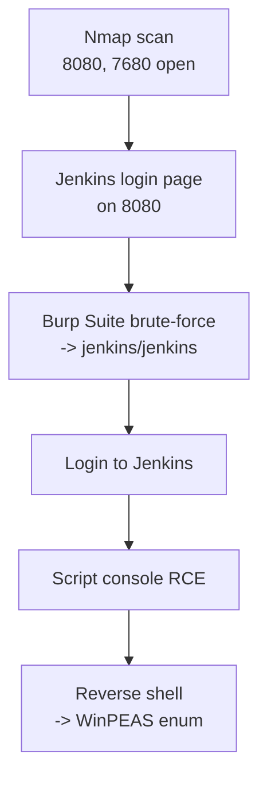
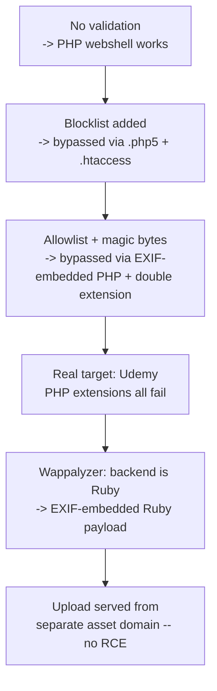
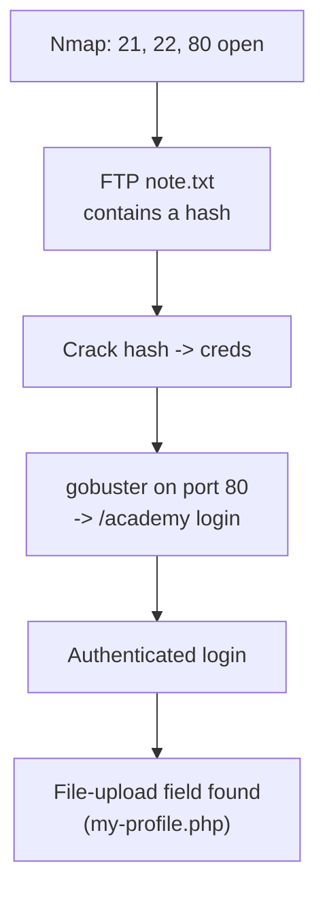

# Web Hacking — Labs

!!! warning "Authorized lab material only"
    These are personal writeups from authorized HTB/THM machines and a bug-bounty program (Udemy), used for learning. Never run these techniques against systems you don't own or have written permission to test.

## Butler

> Nmap enumeration finds a Jenkins login page; Burp Suite brute-forces valid credentials; Jenkins' script console is then abused to get code execution and a reverse shell.

**Chain overview:**



- No version-specific exploit existed for the Jenkins instance, and default credentials (`admin`/`password`) didn't work — so getting in required a separate weakness (a brute-forceable login) before the known Jenkins script-console RCE technique could even be reached. Neither the brute force alone nor the RCE technique alone would have been enough.
- Two weaknesses were chained: **weak/guessable Jenkins credentials** got past authentication, then **Jenkins' built-in script console** (a legitimate admin feature) was abused for code execution — a reminder that "RCE" doesn't always mean a CVE, sometimes it's a powerful feature with a weak credential in front of it.

**Full step-by-step walkthrough:**

- **Why start with Nmap:** before touching anything else, find out what's actually running on the box.

```bash
nmap <target>
```

- Two ports stood out: 8080 and 7680. The most interesting, 8080, was checked first.
- Port 8080 hosted a login page for **Jenkins**. Searching `searchsploit` and the internet found no version-specific exploit, and the default credentials `admin`/`password` didn't work.
- **Why brute-force next:** with no direct exploit and default creds ruled out, brute-forcing the login became the only remaining way in.
- The login form was brute-forced via Burp Suite. A response-length change was spotted on row 6 of the results, corresponding to credentials `jenkins`/`jenkins`.
- Logging in via the browser with `jenkins`/`jenkins` succeeded.
- **Why go straight for code execution after login:** Jenkins exploits found earlier during recon pointed at using the **script console** for RCE once authenticated — this is a legitimate Jenkins admin feature (Groovy script execution), not a vulnerability that needed separate exploitation.
- A reverse-shell script was prepared, a listener was set up on the attacker side, and the script was executed via the Jenkins script console.
- The reverse shell connected back successfully.
- After gaining access, `systeminfo` identified the box as Windows 10 Enterprise — since this is Windows, **WinPEAS** (the Windows equivalent of LinPEAS) was downloaded for further enumeration.

!!! note "Source completeness"
    The captured notes for this machine end at downloading WinPEAS after gaining the initial shell — the OS-level privilege-escalation continuation on this Windows box isn't detailed further here. Windows-specific enumeration/privesc technique pages live under [OS Hacking → Windows](../os-hacking/windows/index.md).

## File upload project (bug bounty case study)

> A self-built file-upload testbed used to practice bypassing upload validation, then the same bypass techniques applied against a real bug-bounty target (Udemy's support chat).

**Chain overview:**



- Each round of hardening on the testbed closed one specific gap (missing validation, then extension blocklist, then magic-bytes/MIME checks) but each new control had its own weak spot — a blocklist misses uncommon extensions, and a magic-bytes check that only reads the first byte can't tell a real PNG from a PNG with a PHP payload stitched into its metadata.
- The real-world target (Udemy) required a different pivot entirely: no PHP extension worked, because the backend wasn't PHP at all — fingerprinting the tech stack (Wappalyzer, see [Information Gathering](information-gathering.md#website-technologies-fingerprinting)) was necessary before the payload *language* itself could be corrected to Ruby.
- See [File Upload → File upload project — validation bypass walkthrough](file-upload.md#file-upload-project-validation-bypass-walkthrough) for the full step-by-step with all four sub-writeups (First attempt, Second attempt, Third security modification, Bug Bounty File Upload) and the actual PHP/Ruby payloads used at each stage.

**Outcome on the real target:** the Ruby EXIF payload uploaded successfully, but the listener never caught a connection — the uploaded file turned out to be served from a separate third-party asset domain (`p23.zdusercontent.com`), not processed or executed by Udemy's own application infrastructure. See [File Upload → Bug Bounty File Upload (Udemy)](file-upload.md#bug-bounty-file-upload-udemy) for the full detail.

## Academy (THM) — recon to file-upload discovery

> Nmap port scan, an FTP-hosted hash crack, directory brute-forcing, and an authenticated login lead to discovering a file-upload RCE opportunity.

**Chain overview:**



- The full recon-to-login chain and the OS-level continuation for this machine are documented in detail elsewhere to avoid duplicating content across pages: see [Scanning & Enumeration → Nmap practical example (Academy, THM)](scanning-enumeration.md#nmap-practical-example-academy-thm) for the full web-facing walkthrough, and [OS Hacking → Linux Labs → Academy](../os-hacking/linux/labs.md#academy-file-upload-rce-os-level-continuation) for the OS-level continuation notes.
- This entry exists so the machine shows up alongside the other lab writeups on this page; the technique detail lives on the pages linked above.
