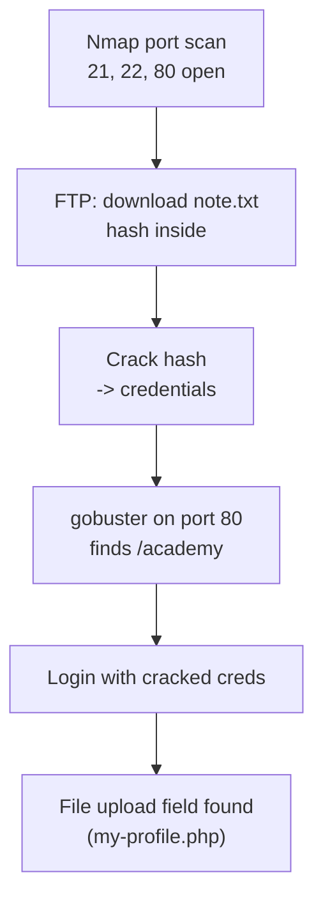

# Web Hacking — Scanning & Enumeration

Scanning and enumeration is the phase after basic recon where we go service-by-service: once a port is known to be open (from [Reconnaissance](reconnaissance.md)), the goal here is to find out exactly *what* is listening on it, *which version*, and whether it can be enumerated or brute-forced further. Most of the workflow below is built around Metasploit's `auxiliary/scanner` modules, one module family per protocol.

## Metasploit basics

- **Why use a database backend:** Metasploit can store scan results (hosts, services, vulns) in a Postgres database so results from Nmap and other scans can be imported, queried, and reused across a whole engagement instead of scrolling back through terminal output.

```bash
service postgresql start
msfconsole
```

- List/manage workspaces (keeps different targets/engagements separate):

```bash
workspace
workspace -a <Name>
```

- Import Nmap XML scan results into the current workspace:

```bash
db_import <file_path>
```

- Confirm data imported successfully:

```bash
hosts
services
vulns
```

- Set a global variable (e.g. so `RHOST` doesn't need to be re-typed for every module):

```bash
setg RHOST <IP_TARGET>
```

## Web (80/443)

- **assetfinder** (built into Kali) also works for finding subdomains here.
- Search for general HTTP auxiliary scripts:

```bash
search type:auxiliray name:http
```

- Identify the HTTP server version:

```bash
use auxiliary/scanner/http/http_version
```

- Pull HTTP response headers:

```bash
use auxiliary/scanner/http/http_header
```

- Scan `robots.txt` content:

```bash
use auxiliary/scanner/http/robots_txt
```

- Scan/brute-force directories:

```bash
use auxiliary/scanner/http/dir_scanner
```

- HTTP file scanner:

```bash
use auxiliary/scanner/http/files_dir
```

- Brute-force an HTTP login form:

```bash
use auxiliary/scanner/http/http_login
```

- Enumerate Apache users:

```bash
use auxiliary/scanner/http/apache_userdir_enum
```

## SMB (445)

- SMB (Server Message Block) is used to share files/printers on a network — misconfigured shares or weak accounts here are a common foothold.
- `RHOST` is set to the victim's IP. General flow: search for a scanner, get the version/name disclosure, then dig into shares/users.
- Search for SMB scanners:

```bash
search type:auxiliary name:smb
```

- Identify SMB version (note: the OS guess isn't always correct):

```bash
use auxiliary/scanner/smb/smb_version
```

- Brute-force/enumerate SMB usernames:

```bash
use auxiliary/scanner/smb/smb_enumusers
```

- Get extra info about the currently selected module:

```bash
info
```

- Enumerate available shares:

```bash
use auxiliray/scanner/smb/smb_enumshares
set ShowFiles true
```

- Brute-force the SMB login:

```bash
use auxiliray/scanner/smb/smb_login
set SMBUser admin
set PASS_FILE /usr/share/metasploit-framework/data/wordlists/unix_passwords.txt
```

- Once credentials are known, list shares directly:

```bash
smbclient -L \\<IP-Target>\ -U admin
```

- Access a specific share:

```bash
smbclient \\<IP-Target>\public -U admin
```

## FTP (21)

- Search for general FTP scripts:

```bash
search type:auxiliray name:ftp
```

- Identify the FTP server version:

```bash
use auxiliary/scanner/ftp/ftp_version
```

- **Why identify the version first:** once the exact FTP daemon/version is known, a targeted exploit search is far more likely to hit than trying exploits blind:

```bash
search ProDTPD
```

- Brute-force the FTP login:

```bash
use auxiliary/scanner/ftp/ftp_login
```

- Common username wordlist for the brute force:

```bash
set USER_FILE /usr/share/metasploit-framework/data/wordlists/common_users.txt
```

- Common password wordlist for the brute force:

```bash
set PASS_FILE /usr/share/metasploit-framework/data/wordlists/unix_passwords.txt
```

## SSH (22)

- Search for SSH scanner scripts:

```bash
search type:auxiliray name:ssh
```

- Identify SSH version:

```bash
use auxiliray/scanner/ssh/ssh_version
```

- Normal password brute force:

```bash
use auxiliray/scanner/ssh/ssh_login
```

- If the target uses public-key authentication instead:

```bash
use auxiliray/scanner/ssh/ssh_login_pubkey
```

## SMTP (25/465/587)

- Search for SMTP scanner scripts:

```bash
search type:auxiliray name:smtp
```

- Identify SMTP version:

```bash
use auxiliray/scanner/smtp/smtp_version
```

- Enumerate valid SMTP users:

```bash
use auxiliray/scanner/smtp/smtp_enum
```

## MySQL (3306)

- Search for MySQL scanner scripts:

```bash
search type:auxiliray name:mysql
```

- Identify MySQL version:

```bash
use auxiliray/scanner/mysql/mysql_version
```

- Brute-force the MySQL login:

```bash
use auxiliray/scanner/mysql/mysql_login
```

- After gaining admin privileges, enumerate the database:

```bash
use auxiliray/admin/mysql/mysql_enum
```

- Run arbitrary SQL queries once authenticated:

```bash
use auxiliray/admin/mysql/mysql_sql
```

## How to exploit

Once a service/version is identified, there are two general approaches to actually exploiting it:

1. Use **Metasploit** — one of the best options when a matching module already exists (fastest, most reliable for known vulnerabilities).
2. **Manual exploitation** — needed when no Metasploit module exists, or when more control over the exploit is required.

## Exploits

- **searchsploit** — searches the Exploit-DB database locally for a specific exploit matching a service/version identified during enumeration.

## Nessus

- Vulnerability scanner referenced as part of the overall methodology alongside Nmap/Nikto — no additional configuration/usage notes were captured in the source material for this page.

## Backup files

- To enumerate a website looking for exposed backup files, use the **BackupFinder** extension in Burp Suite.

## Nmap — practical example (Academy, THM)

Nmap is used to expose all the working ports on a specific machine before deciding where to dig in further.

**Chain overview:**



- Target: Academy, `192.168.1.66`. A scan found 3 open ports: 21, 22, 80 — starting with the easiest, port 21 (FTP).
- FTP hosted a `note.txt` file containing a hash value.
- The hash type was identified with **hash-identifier**, then cracked — the credentials turned out to be user `10201321` / password `student`.
- **Why run gobuster next:** with valid credentials but no known login path yet, directory brute-forcing the web port is the logical next step to find where those credentials should be used.
- `gobuster` against port 80 revealed an `/academy` directory containing a login page.
- Logging in with the cracked credentials succeeded.
- After authenticating, a file-upload mechanism was found in the profile section. Since the upload target is a `.php` endpoint (`my-profile.php`), the plan is to exploit it with a PHP reverse shell — see [File Upload → Reverse shell via file upload](file-upload.md) for the general technique, and [OS Hacking → Linux Labs → Academy](../os-hacking/linux/labs.md#academy-file-upload-rce-os-level-continuation) for where this specific machine's OS-level continuation is documented (this walkthrough's captured notes stop at identifying the upload opportunity).
